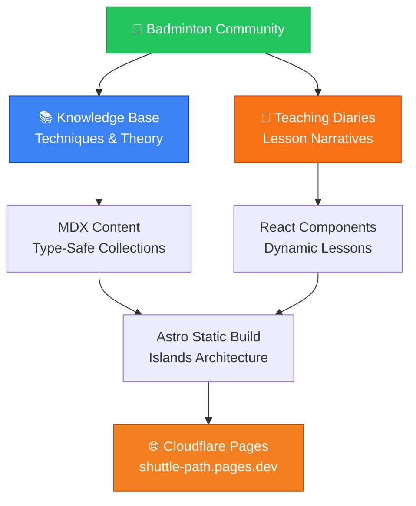

[English](README.md) | [中文](README_CN.md)

<div align="center">

```svg
<svg viewBox="0 0 800 120" xmlns="http://www.w3.org/2000/svg">
  <defs>
    <style>
      @import url('https://fonts.googleapis.com/css2?family=Poppins:wght@700&display=swap');
      .shuttle-title {
        font-family: 'Poppins', sans-serif;
        font-size: 72px;
        font-weight: 700;
        fill: url(#titleGradient);
        letter-spacing: -2px;
      }
      .shuttle-subtitle {
        font-family: 'Poppins', sans-serif;
        font-size: 16px;
        fill: #64748b;
        letter-spacing: 2px;
      }
    </style>
    <linearGradient id="titleGradient" x1="0%" y1="0%" x2="100%" y2="100%">
      <stop offset="0%" style="stop-color:#22c55e;stop-opacity:1" />
      <stop offset="100%" style="stop-color:#f97316;stop-opacity:1" />
    </linearGradient>
  </defs>
  <text x="400" y="75" text-anchor="middle" class="shuttle-title">Shuttle Path</text>
  <text x="400" y="105" text-anchor="middle" class="shuttle-subtitle">Badminton Teaching Knowledge Platform</text>
</svg>
```

**A knowledge platform for badminton enthusiasts and coaches** ✨

[](https://astro.build)
[](https://react.dev)
[](https://www.typescriptlang.org)
[](https://tailwindcss.com)
[](https://mdxjs.com)
[](https://shuttle-path.pages.dev)
[](LICENSE)

[🌐 Live Demo](https://shuttle-path.pages.dev) · [📖 View Docs](./docs/) · [🐛 Report Bug](https://github.com/hakupao/shuttle-path/issues)

</div>

---

## 📋 Table of Contents

- [Overview](#overview)
- [Features](#features)
- [Tech Stack](#tech-stack)
- [Project Structure](#project-structure)
- [Quick Start](#quick-start)
- [Content Management](#content-management)
- [Development](#development)
- [Deployment](#deployment)
- [Contributing](#contributing)
- [License](#license)

---

## 🎯 Overview

<details open>
<summary><strong>Shuttle Path</strong> is a comprehensive teaching knowledge platform designed for badminton enthusiasts and coaches.</summary>

The platform consists of **two core modules**:

1. **Knowledge Base** — Techniques, footwork, sports science with academic formatting and structured technical content
2. **Teaching Diaries** — Immersive storytelling for each lesson with independent visual design (inspired by [pudding.cool](https://pudding.cool))

> Each teaching diary has its own independent visual style — from cherry blossoms falling in spring footwork lessons to creative themes for future content.

</details>

### Architecture Overview



---

## ✨ Features

| Feature | Description |
|---------|-------------|
| 🏝️ **Islands Architecture** | Astro 5 static-first with React components hydrated on-demand |
| 📦 **Content Collections** | Type-safe content management with MDX support for rich component embedding |
| 🎨 **Flexible Design** | Each teaching diary can have independent themes, fonts, color schemes, and animations |
| ✏️ **Hand-Drawn Style** | Vibrant green + sunny orange color scheme with Smiley Sans font |
| 📱 **Responsive Design** | Carefully optimized for both mobile and desktop experiences |
| ♿ **Accessibility** | Semantic HTML, `prefers-reduced-motion` animation fallback |
| 🚀 **Performance** | Static site generation with edge deployment |
| 🔒 **Type Safety** | Full TypeScript support throughout |

---

## 🛠️ Tech Stack

<details open>
<summary><strong>View Technology Details</strong></summary>

| Technology | Version | Purpose |
|-----------|---------|---------|
| **Astro** | 5.7.10 | Static site framework, Content Collections |
| **React** | 19.1.0 | Interactive components (Islands Architecture) |
| **React DOM** | 19.1.0 | React DOM rendering |
| **Tailwind CSS** | 4.1.4 | Utility-first CSS framework |
| **TypeScript** | 5.8.3 | Type-safe JavaScript |
| **MDX** | 4.3.0 | Markdown + JSX content format |
| **@astrojs/react** | 4.2.1 | Astro React integration |
| **@tailwindcss/vite** | 4.1.4 | Tailwind CSS Vite plugin |

**Deployment**: [Cloudflare Pages](https://pages.cloudflare.com)

</details>

---

## 📁 Project Structure

```
shuttle-path/
├── src/
│   ├── components/
│   │   ├── common/              # Shared site-wide (Nav, Footer)
│   │   └── lessons/             # Theme components for teaching diaries
│   ├── content/
│   │   ├── knowledge/           # Knowledge base articles (MDX)
│   │   └── lessons/             # Teaching diaries (MDX)
│   ├── layouts/                 # Page layouts
│   ├── pages/                   # Route pages
│   └── styles/
│       └── global.css           # Design system + Tailwind CSS
├── docs/                        # Development logs and technical plans
├── public/
│   ├── fonts/                   # Smiley Sans custom font
│   └── images/                  # Static image assets
├── astro.config.mjs             # Astro configuration
├── tailwind.config.ts           # Tailwind CSS configuration
├── tsconfig.json                # TypeScript configuration
└── package.json                 # Project dependencies
```

---

## 🚀 Quick Start

### Prerequisites
- **Node.js** 18.0 or higher
- **npm**, **yarn**, or **pnpm** package manager

### Installation

```bash
# Clone the repository
git clone https://github.com/hakupao/shuttle-path.git
cd shuttle-path

# Install dependencies
npm install

# Start development server
npm run dev
# → Visit http://localhost:4321
```

### Available Commands

```bash
# Development server with hot reload
npm run dev

# Build for production
npm run build

# Preview production build locally
npm run preview

# Run Astro CLI commands
npm run astro -- [command]
```

---

## 📝 Content Management

<details>
<summary><strong>Adding New Content</strong> - Knowledge Base Articles</summary>

### Knowledge Base Articles

Create a new article in `src/content/knowledge/`:

```bash
touch src/content/knowledge/your-topic.mdx
```

**Required frontmatter fields:**
```yaml
---
title: "Your Article Title"
description: "Brief description for metadata"
category: "techniques" | "footwork" | "science"
publishDate: 2026-04-01
---
```

**Example:**
```mdx
---
title: "Badminton Footwork Basics"
description: "Master the fundamental footwork patterns"
category: "footwork"
publishDate: 2026-04-04
---

## Introduction
Your article content here...
```

For detailed guidelines, see [`docs/10-内容更新教程.md`](docs/10-内容更新教程.md).

</details>

<details>
<summary><strong>Adding New Content</strong> - Teaching Diaries</summary>

### Teaching Diaries

Create a new diary in `src/content/lessons/`:

```bash
touch src/content/lessons/your-lesson.mdx
```

**Required frontmatter fields:**
```yaml
---
title: "Lesson Title"
date: 2026-04-04
theme: "spring"  # optional: custom theme
---
```

**Design Independence:**
Each teaching diary can have a dedicated Astro theme component in `src/components/lessons/`, enabling completely independent visual design. Example: Spring cherry blossom theme, future creative themes, etc.

**Example:**
```mdx
---
title: "Spring Footwork Lesson"
date: 2026-04-04
theme: "spring"
---

## Today's Focus
Today we practiced foundation steps...
```

</details>

---

## 💻 Development

### Development Documentation

Project requirements, technical solutions, and design decisions are documented in the `docs/` directory:

| Document | Contents |
|----------|----------|
| `01-03` | Requirements discussion and confirmation |
| `04` | Technical solution overview |
| `05` | Deployment options comparison |
| `06-07` | Frontend design direction |
| `08` | Page wireframes and implementation plan |
| `09` | Deliverables checklist |
| `10` | Content update tutorial |

### Key Development Concepts

**Islands Architecture:** Only interactive components are hydrated with JavaScript, keeping the static content lightweight and fast.

**Content Collections:** Type-safe content management with automatic schema validation.

**MDX Integration:** Seamlessly embed React components within Markdown content for rich, interactive articles.

---

## 🌐 Deployment

The project automatically deploys to **Cloudflare Pages** on every push to the main branch:

```
git push origin main
  → GitHub detects push
  → Cloudflare Pages builds automatically
  → Site updates at shuttle-path.pages.dev
```

**Deployment Configuration:**
- **Build Command**: `npm run build`
- **Build Output**: `dist/`
- **Environment**: Production-ready edge network

---

## 🤝 Contributing

Contributions are welcome! Please follow these steps:

1. **Fork** the repository on GitHub
2. **Clone** your fork locally
3. **Create** a feature branch: `git checkout -b feature/your-feature`
4. **Make** your changes with clear commits
5. **Push** to your fork
6. **Open** a Pull Request with description of changes

**Contribution Guidelines:**
- Follow the existing code style (TypeScript, ESLint config)
- Ensure all tests pass
- Update documentation if needed
- Add descriptive commit messages

---

## 📄 License

This project is licensed under the **MIT License** — see the [LICENSE](LICENSE) file for details.

You are free to use this project for personal and commercial purposes.

---

<div align="center">

### 🎾 Made with ❤️ by [hakupao](https://github.com/hakupao)

[⬆ back to top](#-table-of-contents)

**Have questions?** [Open an issue](https://github.com/hakupao/shuttle-path/issues) or reach out on GitHub.

</div>
