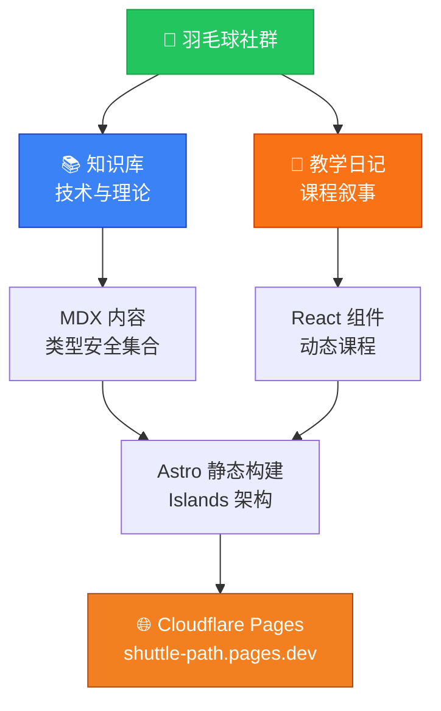

[English](README.md) | [中文](README_CN.md)

<div align="center">

```svg
<svg viewBox="0 0 800 120" xmlns="http://www.w3.org/2000/svg">
  <defs>
    <style>
      @import url('https://fonts.googleapis.com/css2?family=Poppins:wght@700&display=swap');
      .shuttle-title {
        font-family: 'Poppins', sans-serif;
        font-size: 72px;
        font-weight: 700;
        fill: url(#titleGradient);
        letter-spacing: -2px;
      }
      .shuttle-subtitle {
        font-family: 'Poppins', sans-serif;
        font-size: 16px;
        fill: #64748b;
        letter-spacing: 2px;
      }
    </style>
    <linearGradient id="titleGradient" x1="0%" y1="0%" x2="100%" y2="100%">
      <stop offset="0%" style="stop-color:#22c55e;stop-opacity:1" />
      <stop offset="100%" style="stop-color:#f97316;stop-opacity:1" />
    </linearGradient>
  </defs>
  <text x="400" y="75" text-anchor="middle" class="shuttle-title">Shuttle Path</text>
  <text x="400" y="105" text-anchor="middle" class="shuttle-subtitle">羽毛球教学知识平台</text>
</svg>
```

**为羽毛球爱好者和教练量身打造的知识平台** ✨

[](https://astro.build)
[](https://react.dev)
[](https://www.typescriptlang.org)
[](https://tailwindcss.com)
[](https://mdxjs.com)
[](https://shuttle-path.pages.dev)
[](LICENSE)

[🌐 在线预览](https://shuttle-path.pages.dev) · [📖 查看文档](./docs/) · [🐛 报告问题](https://github.com/hakupao/shuttle-path/issues)

</div>

---

## 📋 目录

- [项目概览](#项目概览)
- [核心特性](#核心特性)
- [技术栈](#技术栈)
- [项目结构](#项目结构)
- [快速开始](#快速开始)
- [内容管理](#内容管理)
- [开发指南](#开发指南)
- [部署说明](#部署说明)
- [贡献指南](#贡献指南)
- [开源协议](#开源协议)

---

## 🎯 项目概览

<details open>
<summary><strong>Shuttle Path</strong> 是一个为羽毛球爱好者和教练设计的综合教学知识平台。</summary>

这个平台包含**两个核心模块**：

1. **知识库** — 系统化的手法、步法、运动科学知识，采用学术排版，提供结构化的技术内容
2. **教学日记** — 为每节课设计的沉浸式教学体验，每篇日记都有独立的视觉呈现（灵感来自 [pudding.cool](https://pudding.cool)）

> 每篇教学日记都拥有完全独立的视觉风格——从樱花飘落的春日步法课，到未来更多创意主题的精妙呈现。

</details>

### 架构概览



---

## ✨ 核心特性

| 特性 | 描述 |
|------|------|
| 🏝️ **Islands 架构** | Astro 5 静态优先，React 组件按需水合，性能最优 |
| 📦 **内容集合** | 类型安全的内容管理，支持 MDX 富组件嵌入 |
| 🎨 **独立设计** | 每篇教学日记都可拥有独立的主题、字体、配色和动画 |
| ✏️ **手绘风格** | 活力绿 + 阳光橙的配色，配合得意黑字体 |
| 📱 **响应式设计** | 精心优化的移动端和桌面端体验 |
| ♿ **无障碍友好** | 语义化 HTML，支持 `prefers-reduced-motion` 动画降级 |
| 🚀 **高性能部署** | 静态站点生成，边缘网络加速 |
| 🔒 **类型安全** | 全栈 TypeScript 支持 |

---

## 🛠️ 技术栈

<details open>
<summary><strong>查看技术详情</strong></summary>

| 技术 | 版本 | 用途 |
|------|------|------|
| **Astro** | 5.7.10 | 静态站点框架，内容集合 |
| **React** | 19.1.0 | 交互组件（Islands 架构） |
| **React DOM** | 19.1.0 | React DOM 渲染 |
| **Tailwind CSS** | 4.1.4 | 原子化 CSS 框架 |
| **TypeScript** | 5.8.3 | 类型安全的 JavaScript |
| **MDX** | 4.3.0 | Markdown + JSX 混合格式 |
| **@astrojs/react** | 4.2.1 | Astro React 集成 |
| **@tailwindcss/vite** | 4.1.4 | Tailwind CSS Vite 插件 |

**部署平台**: [Cloudflare Pages](https://pages.cloudflare.com)

</details>

---

## 📁 项目结构

```
shuttle-path/
├── src/
│   ├── components/
│   │   ├── common/              # 全站共享组件（导航、页脚）
│   │   └── lessons/             # 教学日记主题组件
│   ├── content/
│   │   ├── knowledge/           # 知识库文章 (MDX)
│   │   └── lessons/             # 教学日记 (MDX)
│   ├── layouts/                 # 页面布局
│   ├── pages/                   # 路由页面
│   └── styles/
│       └── global.css           # 设计系统 + Tailwind CSS
├── docs/                        # 开发日志与技术方案
├── public/
│   ├── fonts/                   # 得意黑自定义字体
│   └── images/                  # 静态图片资源
├── astro.config.mjs             # Astro 配置
├── tailwind.config.ts           # Tailwind CSS 配置
├── tsconfig.json                # TypeScript 配置
└── package.json                 # 项目依赖
```

---

## 🚀 快速开始

### 前置要求
- **Node.js** 18.0 或更高版本
- **npm**、**yarn** 或 **pnpm** 包管理器

### 安装步骤

```bash
# 克隆仓库
git clone https://github.com/hakupao/shuttle-path.git
cd shuttle-path

# 安装依赖
npm install

# 启动开发服务器
npm run dev
# → 访问 http://localhost:4321
```

### 可用命令

```bash
# 带热重载的开发服务器
npm run dev

# 生产环境构建
npm run build

# 本地预览生产构建
npm run preview

# 运行 Astro CLI 命令
npm run astro -- [command]
```

---

## 📝 内容管理

<details>
<summary><strong>添加新内容</strong> - 知识库文章</summary>

### 知识库文章

在 `src/content/knowledge/` 中创建新文章：

```bash
touch src/content/knowledge/your-topic.mdx
```

**必填 frontmatter 字段：**
```yaml
---
title: "文章标题"
description: "简短描述，用于元数据"
category: "techniques" | "footwork" | "science"
publishDate: 2026-04-01
---
```

**示例：**
```mdx
---
title: "羽毛球步法基础"
description: "掌握基本步法模式"
category: "footwork"
publishDate: 2026-04-04
---

## 介绍
你的文章内容从这里开始...
```

详细指南请查看 [`docs/10-内容更新教程.md`](docs/10-内容更新教程.md)。

</details>

<details>
<summary><strong>添加新内容</strong> - 教学日记</summary>

### 教学日记

在 `src/content/lessons/` 中创建新教学日记：

```bash
touch src/content/lessons/your-lesson.mdx
```

**必填 frontmatter 字段：**
```yaml
---
title: "课程标题"
date: 2026-04-04
theme: "spring"  # 可选：自定义主题
---
```

**设计独立性：**
每篇教学日记都可以在 `src/components/lessons/` 中拥有专属的 Astro 主题组件，实现完全独立的视觉设计。例如：春季樱花主题、未来的创意主题等。

**示例：**
```mdx
---
title: "春季步法课程"
date: 2026-04-04
theme: "spring"
---

## 今日重点
今天我们练习了基础步法...
```

</details>

---

## 💻 开发指南

### 开发文档

项目的需求讨论、技术方案和设计决策记录在 `docs/` 目录中：

| 文档 | 内容 |
|------|------|
| `01-03` | 需求讨论与确认 |
| `04` | 技术方案概览 |
| `05` | 部署方案对比 |
| `06-07` | 前端设计方向 |
| `08` | 页面线框与实施计划 |
| `09` | 交付清单 |
| `10` | 内容更新教程 |

### 关键开发概念

**Islands 架构：** 只有交互组件才需要 JavaScript 水合，保持静态内容的轻量和高效。

**内容集合：** 类型安全的内容管理，自动进行数据模式验证。

**MDX 集成：** 在 Markdown 内容中无缝嵌入 React 组件，创建丰富的交互式文章。

---

## 🌐 部署说明

项目会在每次推送到 main 分支时自动部署到 **Cloudflare Pages**：

```
git push origin main
  → GitHub 检测推送
  → Cloudflare Pages 自动构建
  → 站点更新到 shuttle-path.pages.dev
```

**部署配置：**
- **构建命令**: `npm run build`
- **输出目录**: `dist/`
- **环境**: 生产就绪的边缘网络

---

## 🤝 贡献指南

欢迎贡献代码！请遵循以下步骤：

1. **Fork** GitHub 上的仓库
2. **克隆** 到本地: `git clone https://github.com/your-username/shuttle-path.git`
3. **创建** 功能分支: `git checkout -b feature/your-feature`
4. **提交** 更改（清晰的 commit 信息）
5. **推送** 到你的 fork
6. **开启** Pull Request，描述你的更改

**贡献规范：**
- 遵循现有代码风格（TypeScript、ESLint 配置）
- 确保所有测试通过
- 如需要，更新文档
- 编写描述性的 commit 信息

---

## 📄 开源协议

本项目采用 **MIT 许可证** — 详见 [LICENSE](LICENSE) 文件。

你可以自由地将此项目用于个人和商业用途。

---

<div align="center">

### 🎾 Made with ❤️ by [hakupao](https://github.com/hakupao)

[⬆ 返回顶部](#目录)

**有疑问？** [提交 issue](https://github.com/hakupao/shuttle-path/issues) 或在 GitHub 上联系我们。

</div>
